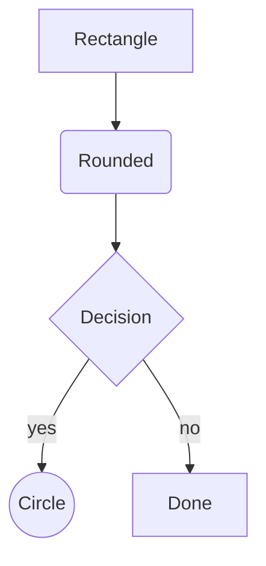
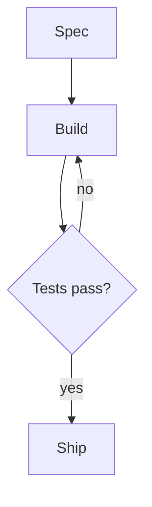
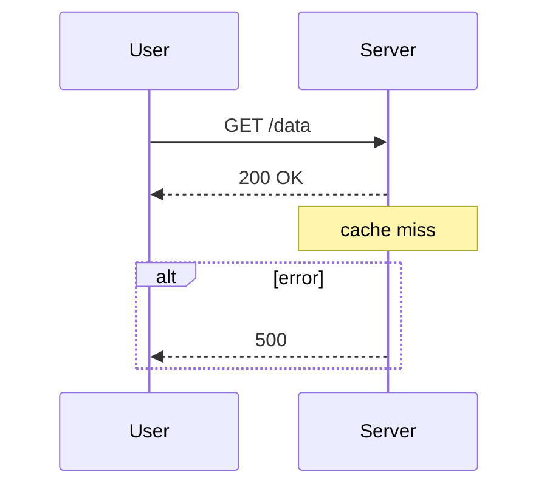
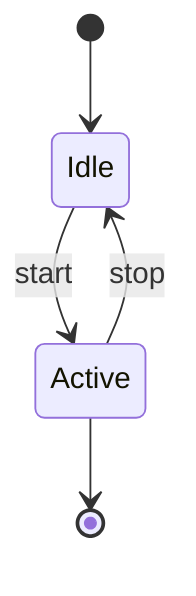
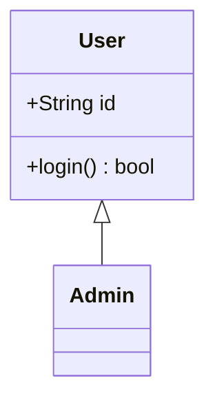
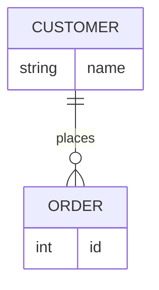
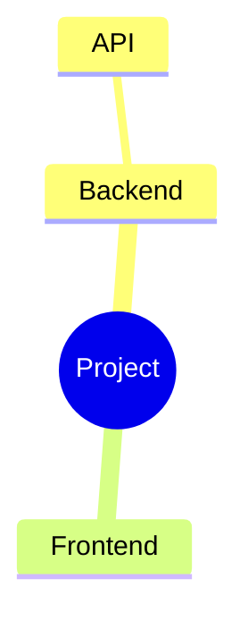

# Mermaid diagrams

Treat this file as executable instructions, not background reading. The terminal
renderer supports a **subset** of Mermaid. If you emit syntax outside this
subset it either errors or renders garbled. Follow the templates exactly and the
NEVER list strictly.

## How to render (mechanism)

1. **Emit a fenced ` ```mermaid ` block in your reply.** sift interactive
   auto-renders it as a terminal diagram directly under your message. This is the
   normal path — the user sees the picture inline. You do not call a tool for
   this; just write the block.

2. **Validate first when it's non-trivial.** Before presenting a diagram with
   more than ~5 nodes, or any time you're unsure of the syntax, render it once to
   confirm it parses. Two ways, whichever you have:
   - call the `render_mermaid` tool with your `source` (sift interactive brain), or
   - pipe it to the CLI in the shell: `printf '%s' "<source>" | sift mermaid`.

   Both return the rendered diagram on success, or a precise
   `mermaid:LINE:COL: message` on failure. Fix the reported line and retry until
   it renders, THEN put it in your reply. Never present a diagram you have not
   gotten to render cleanly.

3. **Render a file:** run `sift mermaid <file.mmd>` in the shell, or call
   `render_mermaid` with `file: "path/to/diagram.mmd"`.

## Supported diagram types

Start the diagram with one of these headers EXACTLY. Anything else errors.

| Type | Header | Best for |
| --- | --- | --- |
| Flowchart | `flowchart TD` (or `graph TD`) | flows, decisions, pipelines, task plans |
| Sequence | `sequenceDiagram` | calls/messages between actors over time |
| State | `stateDiagram-v2` | state machines (flat only) |
| Class | `classDiagram` | types, fields, relationships |
| Entity-relationship | `erDiagram` | data models |
| Mindmap | `mindmap` | hierarchies / breakdowns |
| Architecture | `architecture-beta` | grouped services |
| C4 context | `C4Context` | system context |

Flowchart directions: `TD` / `TB` (top-down), `LR` (left-right), `RL`, `BT`.
`TD` and `LR` read best in a terminal.

## Flowchart — the workhorse (use this most)

Node shapes — **ONLY these four render correctly**:



Edges: `-->` (arrow), `---` (line), `-.->` (dotted), `==>` (thick).
Edge labels: `A -->|label| B` or `A -- label --> B`.
Cycles, fan-out, and converging edges all route correctly.

Example — a plan/task graph (a very common request):



## Other types (verified templates)

Sequence — supports `participant ... as`, activations `->>+ / -->>-`, `Note over X: …`, and `alt/opt/loop/par … end`:



State (flat only — NO nested `state X { }`):



Class (no generics):



ER (cardinality: `||`=1, `o{`=0..N, `|{`=1..N, `o|`=0..1; `--` solid / `..` dashed):



Mindmap (indentation = depth; use `((text))` or `[text]` for the shape):



## NEVER use these (they parse but render broken, or error)

Defaulting to standard Mermaid here will produce garbage. Hard rules:

- **NEVER** use unsupported diagram types: `pie`, `gantt`, `journey`,
  `gitGraph`, `quadrantChart`, `timeline`, `block-beta`. They error immediately.
- **NEVER** use flowchart `subgraph … end` — it errors. Group with a mindmap or
  `architecture-beta` instead.
- **NEVER** use exotic node shapes: `([stadium])`, `[(cylinder)]`,
  `[/parallelogram/]`, `{{hexagon}}`, `[[subroutine]]`. The delimiters leak into
  the label (`([X])` renders as the literal text `[X]`). Use only `[ ]`, `( )`,
  `(( ))`, `{ }`.
- **NEVER** use `A & B --> C` (multi-node), `:::class`, `classDef`, `style …`,
  or `click …` in a flowchart — each errors.
- **NEVER** put a `--- title: … ---` YAML frontmatter block above the diagram —
  it errors. Start directly with the diagram header.
- **NEVER** use `<br/>` in a label (it prints literally), class generics like
  `List~T~` (the `~T~` leaks), nested/composite `state X { }` (spawns a phantom
  node), or sequence `autonumber` (errors).
- **AVOID** self-loops (`A --> A`) — they render as an ugly stub.
- **AVOID** long node labels — there is no wrapping, so a long label becomes one
  very wide box. Keep labels to a few words.
- `end` cannot be a node id (reserved). Rename it (e.g. `done`).

## Workflow

1. Pick the diagram type from the table.
2. Write the diagram using only the templates and shapes above; keep labels short.
3. If it has more than ~5 nodes or you're unsure: call `render_mermaid` with the
   `source`. On `mermaid:LINE:COL:` errors, fix that line and retry.
4. Present the final diagram as a ` ```mermaid ` fenced block in your reply so it
   auto-renders for the user.
