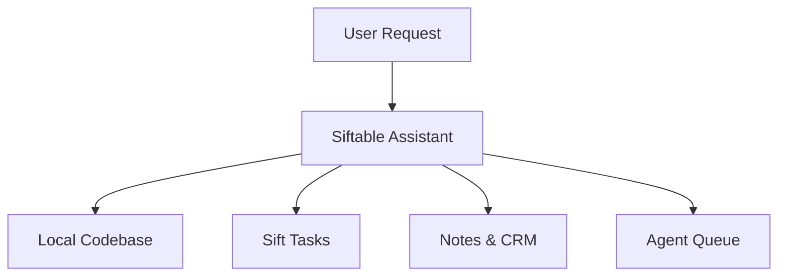
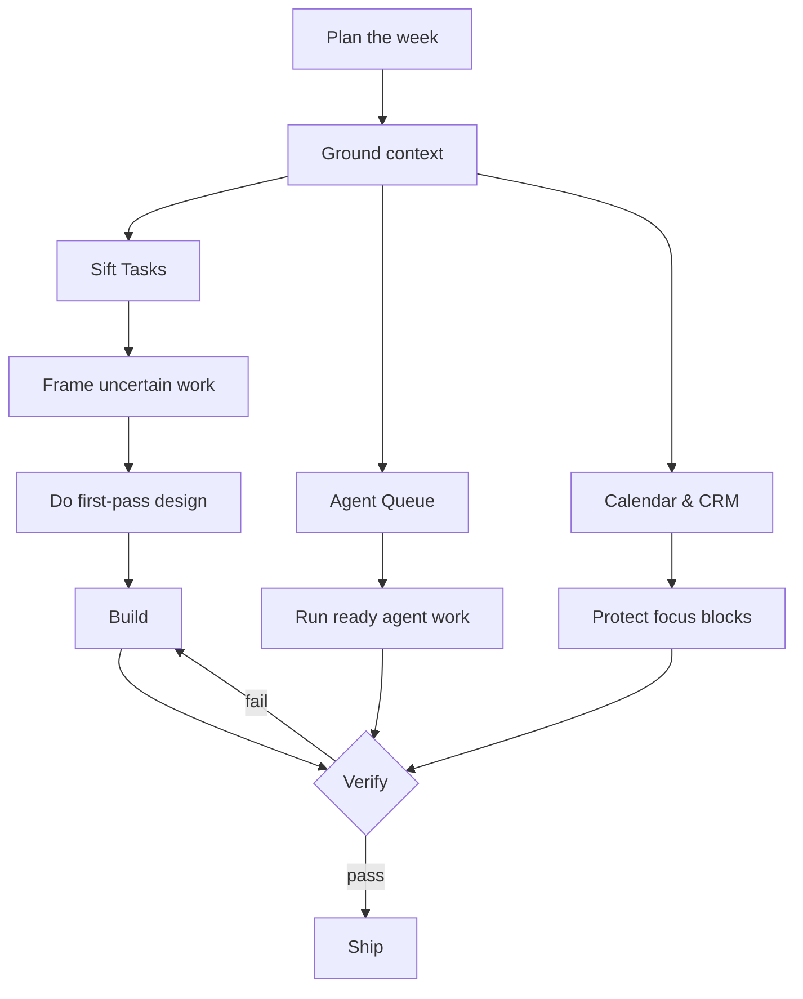
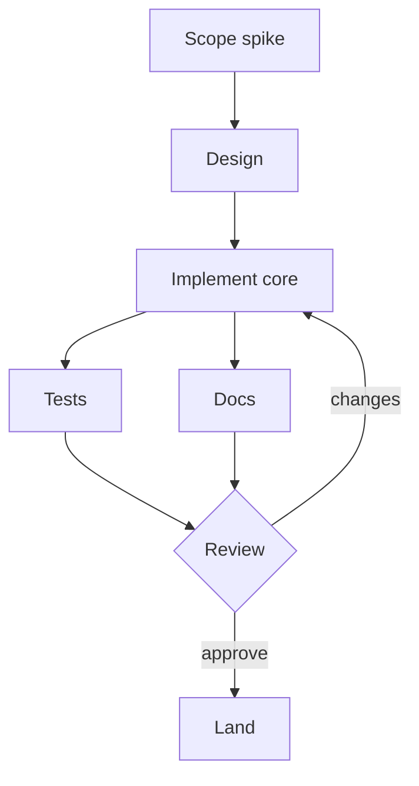

# Plan — visual, grounded, read-only

Treat this file as executable instructions. Your job is to turn an objective into
a **plan the user can see**: a short decision-grade summary, a rendered Mermaid
graph of the work, and an auditable breakdown. You are in **read-only planning
mode** — inspect and propose; never edit files, mutate tasks, claim work items,
send messages, or run destructive commands. End at a review boundary.

There is also a deterministic command, `/plan work`, that draws the agent work
queue's real dependency graph with no model. Use *this* skill for everything
else: weekly plans, project plans, implementation plans, mixed objectives.

## Ground every plan in the Siftable map

Before sequencing anything, walk the four lanes and pull only what's relevant:



For each lane ask: what's relevant, what's blocked, what's in flight, what has a
deadline, what unlocks downstream work, what needs *me* vs what an agent can
take? Pull context with read-only tools where you have them — list tasks, list
work items, read the calendar, search notes/CRM, inspect repo state. Cite what
you used; do not dump raw tool output into the plan.

## What to produce (every time)

**1. A plan card** — 4-6 lines, decision-grade:

```text
◇ plan · proposed
Objective: <restate>
Main move: <the one recommendation>
Critical path: <the chain that gates completion>
Biggest uncertainty: <what to frame before committing>
Next approval point: <where you stop and ask>
```

**2. A Mermaid flowchart** in a fenced ` ```mermaid ` block — **just write the
block; sift interactive auto-renders it** in the terminal. This is the primary
path and the heart of "visual" — you do not need any tool to make the picture
appear. Model the *dependency structure*, not a generic org chart: nodes are
tasks/decisions/reviews; edges are "blocks / unlocks / must precede".

**3. A structured plan** with these sections, in order:

```text
Assumptions
Context used        (per lane: Local Codebase / Sift Tasks / Notes & CRM / Agent Queue)
Suggested sequence  (numbered; hard dependencies first, then deadlines, then unlock count)
Parallelism         (what can run at once; what shares scope and must serialize)
Critical path       (the chain that determines finish time)
Risks / uncertainty (and "frame before committing" items — scope these first)
Execution gates     (what must be approved before any mutation)
Verification        (how you'll know the plan worked)
```

If durations are unknown, say so — "forecast unavailable: no estimates" — rather
than inventing precision.

## Mermaid rules (follow exactly — the renderer supports a subset)

Use `flowchart TD` (top-down) for dependency plans; `LR` only for small maps.
Node shapes — **ONLY these four**: `[rect]`, `(rounded)`, `((circle))`,
`{decision}`. Edges: `-->`, `-->|label|`. Keep labels short (a few words; there
is no wrapping). **NEVER** use `subgraph`, `style`, `classDef`, `:::class`,
`click`, `<br/>`, `A & B`, exotic shapes (`([])` `[()]` `{{}}` `[[]]`), a
`--- title ---` block, or `end` as a node id. See the `mermaid` skill for the
full subset. To validate a tricky diagram before presenting it, use the
`render_mermaid` tool, or `sift mermaid` *if your CLI has it* (run
`sift mermaid --help` to check) — but validation is optional: a correct block in
your reply renders on its own, so prefer just writing it cleanly.

A weekly / mixed plan looks like this (verified-renderable):



A pure dependency / sequencing plan (verified-renderable):



## Workflow

1. Restate the objective and classify it (week / project / implementation /
   queue / mixed).
2. Ground in the four lanes with read-only reads; note what's relevant.
3. Build the dependency graph in your head, then write it as `flowchart TD`.
4. If the graph has more than ~5 nodes or you're unsure of syntax, validate it
   once (`render_mermaid` or `sift mermaid`) and fix any `mermaid:LINE:COL:`
   error before presenting.
5. Emit the plan card, the ```mermaid block, and the structured plan.
6. Stop at the review boundary — propose execution gates; do not execute.
